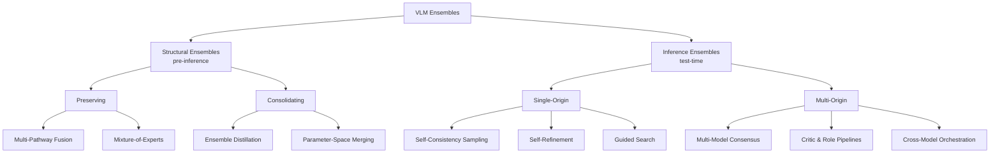

# Awesome VLM Ensembles: Intervention Timing Taxonomy

Companion repository for **"From Architectural Synergy to Test-Time Scaling: A Survey of Intervention Timing in Vision-Language Model Ensembles"** (Dat Nguyen Huu, Duong Nguyen Minh, My Hoang Ha — Applied AI Lab, Phenikaa School of Computing, Phenikaa University).

This repo tracks the 84 works classified under the survey's **Mode → Category → Sub** taxonomy, organized along the paper's primary axis, **intervention timing**: does a method combine capability sources before inference (**Structural Ensembles**) or at inference time (**Inference Ensembles**)?

> Every taxonomy gap or boundary case in the survey is stated as a *falsifiable claim* about the current corpus (Sections 4 and 9). This repo exists so the corpus can be checked and extended as new falsifying work appears — see [Contributing](#contributing).

---

## Contents

- [Taxonomy overview](#taxonomy-overview)
- [Structural Ensembles](#structural-ensembles)
  - [Preserving — Multi-Pathway Fusion](#preserving--multi-pathway-fusion)
  - [Preserving — Mixture-of-Experts](#preserving--mixture-of-experts)
  - [Consolidating — Ensemble Distillation](#consolidating--ensemble-distillation)
  - [Consolidating — Parameter-Space Merging](#consolidating--parameter-space-merging)
- [Inference Ensembles](#inference-ensembles)
  - [Single-Origin](#single-origin)
  - [Multi-Origin](#multi-origin)
- [Known taxonomy gaps](#known-taxonomy-gaps)
- [Contributing](#contributing)
- [Citation](#citation)

---

## Taxonomy overview

<!-- TODO: replace with the actual classification-diagram figure from the paper (e.g. Figure 2). -->
<!-- Update the filename/path below once the real image is added to assets/. -->


<details>
<summary>Mermaid fallback (renders if the image above is missing)</summary>



</details>

**Reading the grids** (Table 1 in the survey): each pillar is a 2×3 grid (Fate×Locus for Structural, Source×Shape for Inference). Two cells are documented gaps rather than missing entries — see [Known taxonomy gaps](#known-taxonomy-gaps).

---

## Structural Ensembles

Multi-source integration frozen before deployment; inference runs on a static architecture.

### Preserving — Multi-Pathway Fusion

Sources co-exist and are fused at the feature-representation level.

**Concatenation (incl. Interleaving)**

| Work | Citation |
|---|---|
| DeepSeek-VL | Lu et al., 2024 — [arXiv:2403.05525](https://arxiv.org/abs/2403.05525) |
| Eagle-X5 | Shi et al., ICLR 2025 |
| MouSi | Fan et al., 2024 — [arXiv:2401.17221](https://arxiv.org/abs/2401.17221) |
| BLIVA | Hu et al., 2023 — [arXiv:2308.09936](https://arxiv.org/abs/2308.09936) |
| Prismatic VLMs | Karamcheti et al., ICML 2024 |
| Groma | Ma et al., ECCV 2024 |
| Osprey | Yuan et al., CVPR 2024 |
| LEO | Azadani et al., 2025 — [arXiv:2501.06986](https://arxiv.org/abs/2501.06986) |

**Cross-Attention**

| Work | Citation |
|---|---|
| Cambrian-1 | Tong et al., NeurIPS 2024 |
| MERV | Chung et al., ICML 2025 |
| BRAVE | Kar et al., ECCV 2024 |
| Prismer | Liu et al., TMLR |
| CoME-VL | Deria et al., 2026 — [arXiv:2604.03231](https://arxiv.org/abs/2604.03231) |
| Mini-Gemini | Li et al., IEEE TPAMI 2026 |
| Point-Bind & Point-LLM | Guo et al., 2023 — [arXiv:2309.00615](https://arxiv.org/abs/2309.00615) |

### Preserving — Mixture-of-Experts

Sparse gated routing among experts.

**Vision-side**

| Work | Citation |
|---|---|
| MoVA | Zong et al., NeurIPS 2024 |
| SCOPE | Zhang et al., 2025 — [arXiv:2510.12974](https://arxiv.org/abs/2510.12974) |
| Mixpert | He et al., 2025 — [arXiv:2505.24541](https://arxiv.org/abs/2505.24541) |
| CuMo | Li et al., NeurIPS 2024 |
| MoCHA | Pang et al., AAAI 2026 |

**LLM-side**

| Work | Citation |
|---|---|
| CL-MoE | Huai et al., CVPR 2025 |
| RS-MoE | Lin et al., IEEE TGRS 2025 |
| Kimi-VL | Kimi Team, 2025 — [arXiv:2504.07491](https://arxiv.org/abs/2504.07491) |
| Uni3D-MoE | Zhang et al., 2025 — [arXiv:2505.21079](https://arxiv.org/abs/2505.21079) |
| MoE-LLaVA | Lin et al., IEEE TMM 2026 |
| Aria | Li et al., 2025 — [arXiv:2410.05993](https://arxiv.org/abs/2410.05993) |
| Med-MoE | Jiang et al., EMNLP Findings 2024 |
| DeepSeek-VL2 | Wu et al., 2024 — [arXiv:2412.10302](https://arxiv.org/abs/2412.10302) |
| RSUniVLM | Liu & Lian, Pattern Recognition 2026 |
| SkyMoE | Liu et al., AAAI 2026 |
| MicarVLMoE | Izhar et al., IJCNN 2025 |
| 3D-MoE | Ma et al., 2025 — [arXiv:2501.16698](https://arxiv.org/abs/2501.16698) |
| CoGR-MoE | Zeng et al., ACL Findings 2026 |
| MoE-GRPO | Ko et al., 2026 — [arXiv:2603.24984](https://arxiv.org/abs/2603.24984) |
| Uni-MoE | Li et al., IEEE TPAMI 2025 |
| AnyExperts | Gao et al., 2025 — [arXiv:2511.18314](https://arxiv.org/abs/2511.18314) |

**Native**

| Work | Citation |
|---|---|
| MoMa | Lin et al., 2024 — [arXiv:2407.21770](https://arxiv.org/abs/2407.21770) |
| Mixture-of-Transformers | Liang et al., TMLR — [arXiv:2411.04996](https://arxiv.org/abs/2411.04996) |

### Consolidating — Ensemble Distillation

Teacher ensemble compressed into one dense student.

| Work | Citation |
|---|---|
| MoVE-KD | Cao et al., CVPR 2025 |
| AM-RADIO | Ranzinger et al., CVPR 2024 |
| Drive-KD | Lian et al., 2026 — [arXiv:2601.21288](https://arxiv.org/abs/2601.21288) |

### Consolidating — Parameter-Space Merging

Weights or task vectors merged without gradient retraining.

**Learned-Coefficient**

| Work | Citation |
|---|---|
| OptMerge | Wei et al., ICLR — [arXiv:2505.19892](https://arxiv.org/abs/2505.19892) |
| AdaMMS | Du et al., CVPR 2025 |
| Expert Merging | Zhang et al., 2025 — [arXiv:2509.25712](https://arxiv.org/abs/2509.25712) |
| FRISM | Huang et al., 2026 — [arXiv:2601.21187](https://arxiv.org/abs/2601.21187) |

**Evolutionary-Search**

| Work | Citation |
|---|---|
| EvoVLM-JP | Akiba et al., Nature Machine Intelligence 2025 |
| JRadiEvo | Baba et al., NeurIPS Workshop 2024 — [arXiv:2411.09933](https://arxiv.org/abs/2411.09933) |

**Task-Vector**

| Work | Citation |
|---|---|
| RobustMerge | Zeng et al., NeurIPS 2025 |
| MMER | Li et al., ACL 2025 |
| Locate-then-Merge | Yu & Ananiadou, EMNLP Findings 2025 |
| Bring Reason to Vision | Chen et al., ICML 2025 |

---

## Inference Ensembles

Multi-source integration re-activated at query time; latency scales with query difficulty.

### Single-Origin

**Self-Consistency Sampling**

| Work | Citation |
|---|---|
| Agro-Consensus | Gupta et al., 2025 — [arXiv:2510.21757](https://arxiv.org/abs/2510.21757) |
| AdaVIS | Jeddi et al., 2026 — [arXiv:2606.11576](https://arxiv.org/abs/2606.11576) |

**Self-Refinement**

| Work | Citation |
|---|---|
| Visual CoT | Shao et al., NeurIPS 2024 |
| Volcano | Lee et al., NAACL 2024 |
| TTAdapt | Kaya et al., ICLR — [arXiv:2510.03574](https://arxiv.org/abs/2510.03574) |
| H-GIVR | Yang et al., 2026 — [arXiv:2602.04413](https://arxiv.org/abs/2602.04413) |
| MUG | Liang et al., AAAI 2026 |
| ViF | Yu et al., ICLR — [arXiv:2509.21789](https://arxiv.org/abs/2509.21789) |
| GAM-Agent | Zhang et al., NeurIPS — [arXiv:2505.23399](https://arxiv.org/abs/2505.23399) |

**Guided Search**

| Work | Citation |
|---|---|
| VisuoThink | Wang et al., ACL 2025 |
| Nash Equilibrium | Sinha et al., 2026 — [arXiv:2605.20033](https://arxiv.org/abs/2605.20033) |
| V* | Wu & Xie, CVPR 2024 |

### Multi-Origin

**Multi-Model Consensus**

| Work | Citation |
|---|---|
| Diversity Matters | Tong et al., 2026 — [arXiv:2605.30713](https://arxiv.org/abs/2605.30713) |
| Vision Verification | Tekin et al., 2026 — [arXiv:2603.12669](https://arxiv.org/abs/2603.12669) |
| Beyond Single Models | Li et al., 2025 — [arXiv:2510.18321](https://arxiv.org/abs/2510.18321) |
| Hidden Clones | Bugaud, 2026 — [arXiv:2603.17111](https://arxiv.org/abs/2603.17111) |

**Critic & Role Pipelines — Tool**

| Work | Citation |
|---|---|
| Woodpecker | Yin et al., Science China Information Sciences 2024 |
| MM-ReAct | Yang et al., 2023 — [arXiv:2303.11381](https://arxiv.org/abs/2303.11381) |
| ViperGPT | Surís et al., ICCV 2023 |
| LLaVA-Plus | Liu et al., ECCV 2024 |
| MM-VID | Lin et al., 2023 — [arXiv:2310.19773](https://arxiv.org/abs/2310.19773) |

**Critic & Role Pipelines — Role**

| Work | Citation |
|---|---|
| Mobile-Agent-v2 | Wang et al., NeurIPS 2024 |
| Be My Eyes | Huang et al., 2025 — [arXiv:2511.19417](https://arxiv.org/abs/2511.19417) |
| Traffic Multi-Agent | Yang et al., Applied Computing and Intelligence 2025 |

**Critic & Role Pipelines — Critic**

| Work | Citation |
|---|---|
| Critic-V | Zhang et al., CVPR — [arXiv:2411.18203](https://arxiv.org/abs/2411.18203) |
| MMC | Liu et al., 2025 — [arXiv:2504.11009](https://arxiv.org/abs/2504.11009) |

**Cross-Model Orchestration**

| Work | Citation |
|---|---|
| VisProg | Gupta & Kembhavi, CVPR 2023 |
| MACT | Yu et al., 2025 — [arXiv:2508.03404](https://arxiv.org/abs/2508.03404) |
| VipAct | Zhang et al., AAAI 2026 |
| MMedAgent-RL | Xia et al., ICLR — [arXiv:2506.00555](https://arxiv.org/abs/2506.00555) |
| MATA | Cai et al., 2026 — [arXiv:2601.19204](https://arxiv.org/abs/2601.19204) |
| AVIS | Hu et al., NeurIPS 2023 |
| DyFo | Li et al., CVPR — [arXiv:2504.14920](https://arxiv.org/abs/2504.14920) |

---

## Known taxonomy gaps

Per the survey's falsifiability principle (Sections 4.3 and 7.1), these are explicit, checkable claims about the current corpus — not omissions:

- **Consolidating × Computation** (Structural grid): no VLM work yet distills a trained Mixture-of-Experts into a single dense model. This is the taxonomy's one genuine open cell.
- **Preserving × Parameter** (Structural grid): not a gap — this combination collapses into Mixture-of-Experts and is excluded on logical grounds (Section 4.3.1).
- **Dispatch vs. Orchestration** (Cross-Model Orchestration): four very recent works (ReLope, ECVL-Router, AVR, LatentRouter) select a single model and hand off, rather than continuing to coordinate. Not yet enough instances to justify a new Sub-tier (Section 9.4).

If you know of a work that closes the Consolidating×Computation gap or otherwise falsifies a claim in the survey, please open an issue — see below.

---

## Contributing

This corpus was assembled by literature search finalized **July 2026** (arXiv, OpenReview, CVPR/ICCV/ECCV/NeurIPS/ICLR/ACL proceedings, plus citation snowballing). VLM ensembling is a fast-moving area, so if you know of:

- a new work that fits an existing Category/Sub,
- a work that plausibly closes the Consolidating×Computation gap,
- a correction to any entry above,

please open an issue or PR with: paper title, authors, venue/arXiv link, and which Pillar → Mode → Category → (Sub) cell it belongs to, briefly justified against the three membership conditions in Section 4.1 of the survey (Multiplicity, VLM-ness, Timeframe).

---

## Citation

If you use this taxonomy or corpus, please cite the survey:

```bibtex
@article{nguyenhuu2026vlmensembles,
  title   = {From Architectural Synergy to Test-Time Scaling: A Survey of Intervention Timing in Vision-Language Model Ensembles},
  author  = {Nguyen Huu, Dat and Nguyen Minh, Duong and Hoang Ha, My},
  journal = {Array},
  year    = {2026},
  note    = {Applied AI Lab, Phenikaa School of Computing, Phenikaa University}
}
```

*(Update volume/pages/DOI once the camera-ready is published.)*

---

## License

Repository content (README, tables) licensed under [MIT](LICENSE). This is a companion index — copyright of individual surveyed papers belongs to their respective authors/publishers.
